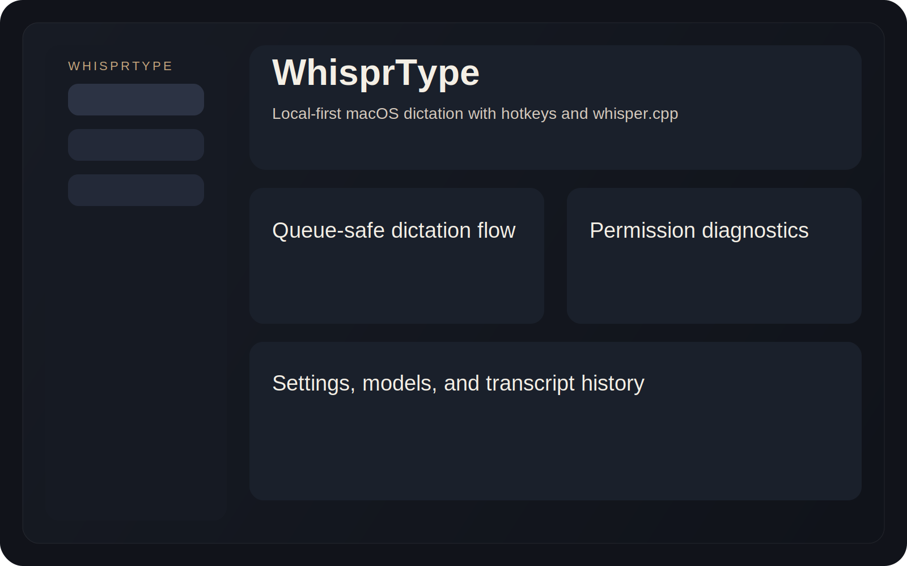
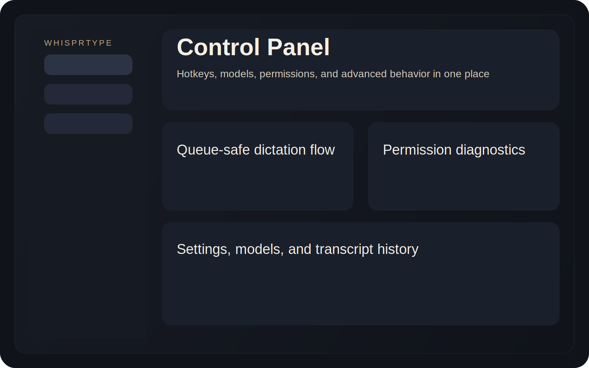
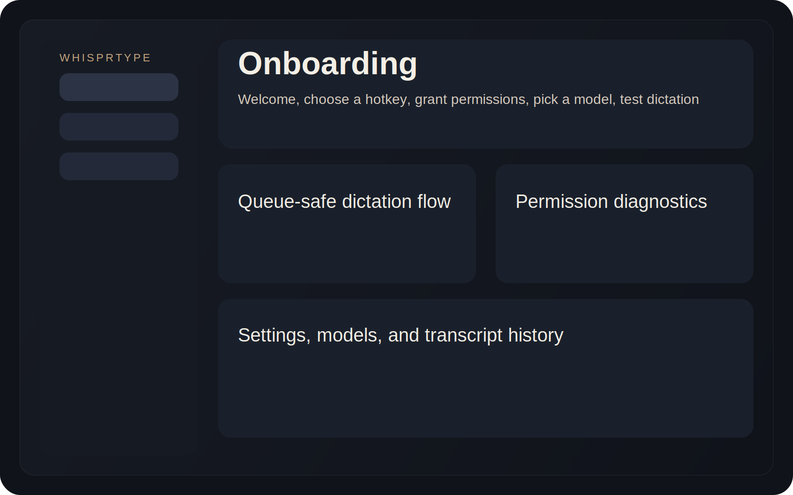

# WhisprType

WhisprType is a local-first macOS dictation app for people who want a fast global hotkey, local `whisper.cpp` transcription, and text that lands directly in the app they are already using.

It is designed as a serious open source macOS dictation product that stays offline-by-default, is easy to install from scratch, and does not assume the user already has a local speech stack configured by hand.



## What It Does

- Runs as a macOS desktop app with a clean control panel
- Uses a global hotkey to start and stop dictation
- Transcribes locally with `whisper.cpp`
- Pastes finished text into the active app
- Lets finished transcripts paste immediately, even while another recording is already in progress
- Supports optional `Globe/Fn -> F18` mapping through a bundled Karabiner preset

## Demo





## Why WhisprType

- `Local-first`: no cloud requirement for the core product
- `Built for real workflows`: hotkeys, queueing, paste-anywhere, permissions diagnostics
- `macOS-native deployment`: DMG + ZIP release targets
- `Open source`: documented architecture, visible configs, tweakable scripts

## Features

- Toggle recording and push-to-talk modes
- Immediate paste, clipboard-only, and slow typing output modes
- Configurable hotkey and capture behavior
- Whisper model selection and backend diagnostics
- Menubar-first workflow with a full control panel
- Onboarding flow for permissions and first-run setup
- Optional Karabiner preset for Globe/Fn users

## Quick Start

### Install from a release

```bash
curl -fsSL https://raw.githubusercontent.com/batuhankaraman/whisprtype/main/scripts/install-latest-macos.sh | bash
```

### Run from source

```bash
git clone https://github.com/batuhankaraman/whisprtype.git
cd whisprtype
./scripts/bootstrap-macos.sh
npm install
npm run tauri dev
```

## macOS Install

You need:

- macOS 13 or newer
- Microphone permission
- Accessibility permission for paste/type automation
- Rust toolchain for source builds
- Node.js 20+ for source builds

Prebuilt releases ship as:

- `WhisprType_<version>_aarch64.dmg`
- `WhisprType_<version>_aarch64.app.tar.gz`

## Permissions

WhisprType needs two macOS permissions:

1. `Microphone`
2. `Accessibility`

The app includes a diagnostics page that explains what is missing and where to fix it.

See [docs/PERMISSIONS.md](./docs/PERMISSIONS.md) for the full guide.

## Hotkeys and Globe/Fn

The default hotkey is:

```text
Cmd + Shift + Space
```

If you want a dedicated dictation key on Apple keyboards, use the bundled Karabiner preset:

- [extras/karabiner/fn-to-f18.json](./extras/karabiner/fn-to-f18.json)

Then bind `F18` inside WhisprType.

This is optional. WhisprType does not require Karabiner to function.

## Configuration

WhisprType stores its config in:

```text
~/Library/Application Support/WhisprType/config.json
```

Example config:

```json
{
  "hotkey": {
    "mode": "toggle",
    "combo": "Cmd+Shift+Space"
  },
  "capture": {
    "inputDevice": "default",
    "preRollMs": 350,
    "postRollMs": 200
  },
  "transcription": {
    "engine": "whispercpp",
    "model": "large-v3",
    "language": "auto",
    "threads": "auto",
    "serverIdleSecondsBattery": 75,
    "serverIdleSecondsAC": 300
  },
  "output": {
    "mode": "immediate",
    "pasteWhileRecording": true
  },
  "storage": {
    "recordingsDir": "~/Documents/WhisprType/Recordings",
    "keepAudioDays": 14,
    "keepTranscriptDays": 30
  },
  "ui": {
    "showHud": true
  }
}
```

See [config/config.example.json](./config/config.example.json) and [docs/CONFIGURATION.md](./docs/CONFIGURATION.md).

## Troubleshooting

- `Text is not pasting`
  - Check Accessibility permission first
- `Hotkey works but transcription does not start`
  - Open Models & Performance and confirm the runtime bootstrap completed
- `Model not found`
  - Download the model from the app-managed model flow
- `Globe/Fn does nothing`
  - Use the bundled Karabiner preset or choose another hotkey

## Architecture

WhisprType uses:

- `Tauri v2`
- `React + TypeScript`
- `Rust backend`
- `whisper.cpp` for local transcription

Subsystems:

- `capture`
- `transcription`
- `automation`
- `diagnostics`

See [docs/ARCHITECTURE.md](./docs/ARCHITECTURE.md).

## Build From Source

```bash
./scripts/bootstrap-macos.sh
npm install
npm run tauri dev
```

For production packaging:

```bash
npm run build
npm run tauri build
```

## Contributing

Bug reports, packaging fixes, performance tuning, and UI polish are welcome.

Start with:

- [CONTRIBUTING.md](./CONTRIBUTING.md)
- [CODE_OF_CONDUCT.md](./CODE_OF_CONDUCT.md)
- [SECURITY.md](./SECURITY.md)

## License

WhisprType is released under the [MIT License](./LICENSE).

## Sources and Acknowledgements

WhisprType is built on top of the following core technologies:

- [ggml-org/whisper.cpp](https://github.com/ggml-org/whisper.cpp)
- [Tauri](https://tauri.app/)
- [React](https://react.dev/)
- [TypeScript](https://www.typescriptlang.org/)
- [Vite](https://vite.dev/)
- [Karabiner-Elements](https://karabiner-elements.pqrs.org/) for the optional Globe/Fn preset

Full notes live in [docs/SOURCES.md](./docs/SOURCES.md).

WhisprType is not affiliated with Wispr Flow.
